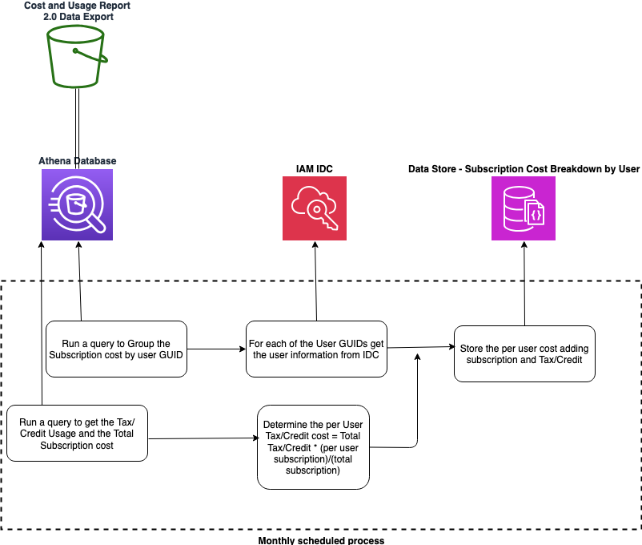

# Q Developer Subscription Cost Breakdown


Oragnizations need an effective way to chargeback Q Developer subscription charges. These charges are accumulated at the payer level and the large enterprises need to distribute those charges to the corresponding business units. 

The routine provided will query the CUR data using Athena to identify the Q developer subscription charges grouped by the user GUID. It will then look up the user informtion from IAM IDC and store the cost and the user email in a DynamoDB table.



# Installation
After cloning the repo:
1. Deploy the CloudFormation template using ``template.yaml``

2. Build the Docker container and push it to ECR


```
#!/bin/bash
AWS_ACCOUNT={your-aws-account}
AWS_REGION={your-region}
ECR_REPO=q-dev-cost-analyzer

#Build the container
docker build -t ${ECR_REPO} .

#Tag and Push the container to ECR
aws ecr get-login-password --region ${AWS_REGION} | docker login --username AWS --password-stdin ${AWS_ACCOUNT}.dkr.ecr.${AWS_REGION}.amazonaws.com
docker tag ${ECR_REPO}:latest ${AWS_ACCOUNT}.dkr.ecr.${AWS_REGION}.amazonaws.com/${ECR_REPO}:latest
docker push ${AWS_ACCOUNT}.dkr.ecr.${AWS_REGION}.amazonaws.com/${ECR_REPO}:latest

```
3. Run the batch job

```
aws batch submit-job \
    --job-name q-dev-cost-analysis \
    --job-queue {your-job-queue} \
    --job-definition q-dev-cost-analyzer \
    --parameters '{"year":"{yyyy}","month":"{mm}"}'

```

# Cleanup

Delete the CloudFormation Template