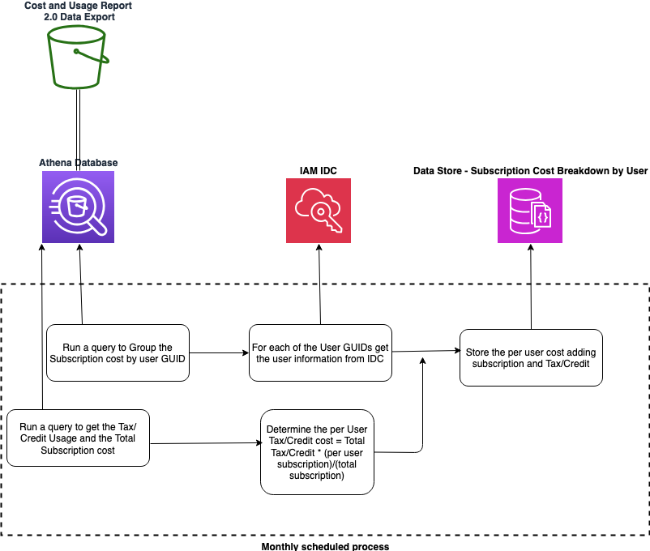

## Amazon Q Developer Subscription Cost Breakdown

Oragnizations need an effective way to chargeback Q Developer subscription charges. These charges are accumulated at the payer level and the large enterprises need to distribute those charges to the corresponding business units. 

The routine provided will query the CUR data using Athena to identify the Q developer subscription charges grouped by the user GUID. It will then look up the user informtion from IAM IDC and store the cost and the user email in a DynamoDB table.

## Security

See [CONTRIBUTING](CONTRIBUTING.md#security-issue-notifications) for more information.

## License

This library is licensed under the MIT-0 License. See the LICENSE file.

